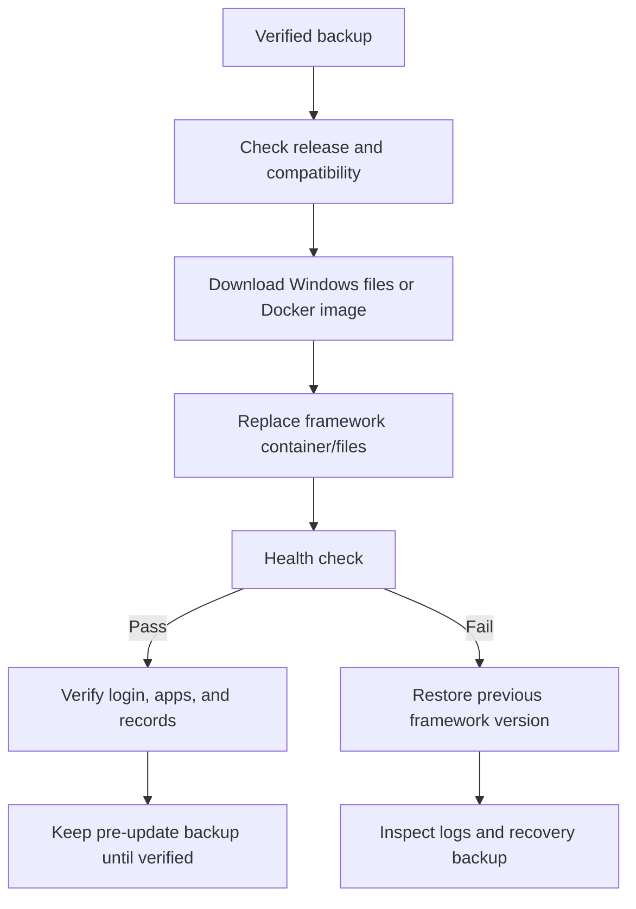

# Update the framework

## Purpose

Install the latest stable GitHub Release while preserving apps and databases.

## Audience

Framework administrators and deployment operators.

## Update flow

## Web procedure

1. Sign in as a Framework Administrator.
2. Open **System Maintenance** and choose **Check for updates**.
3. Review the version and release notes.
4. Choose **Update to latest stable** and confirm downtime.
5. Keep the page open while it reconnects and verify the final status.

The system creates and validates a `.emubackup` before starting. Windows verifies release SHA-256; Docker pulls the immutable GHCR version tag and restores the previous container if health checks fail.

For Docker, the app contacts the internal updater service using `EMU_UPDATER_URL` and `EMU_UPDATER_TOKEN`. The updater controls Docker through the mounted Docker socket, pulls the target app image, replaces the app container, and checks its health. The updater itself does not need a published host port.

The persistent `emu-data` volume is reused by the replacement container. Container rollback does not roll back database contents; keep the pre-update `.emubackup` until the new version has been verified.

When upgrading to v0.1.0.2, complete **Administrator setup** if the server detects the legacy `admin` / `admin` credentials or no enabled user with `FW_SystemAdminRole`. The automatic `.emubackup` does not include `.emu-secret.key`: preserve that key separately, verify administrator role assignments, and test SMTP after the update.

## Manual fallback

- Windows: run `Update.cmd`.
- Docker: set `EMU_VERSION` to the required stable version, then run `docker compose pull app && docker compose up -d app`.

If the app was created manually rather than through Compose, recreate it with `EMU_DEPLOYMENT_MODE=docker`, `EMU_UPDATER_URL=http://updater:3400`, the matching token, the same user-defined network as the updater, and the existing named `/data` volume.

Updates support only forward movement to the latest stable version. Database rollback is never automatic.

## Related topics

[Backup](backup.md) · [Recovery](recovery.md)
