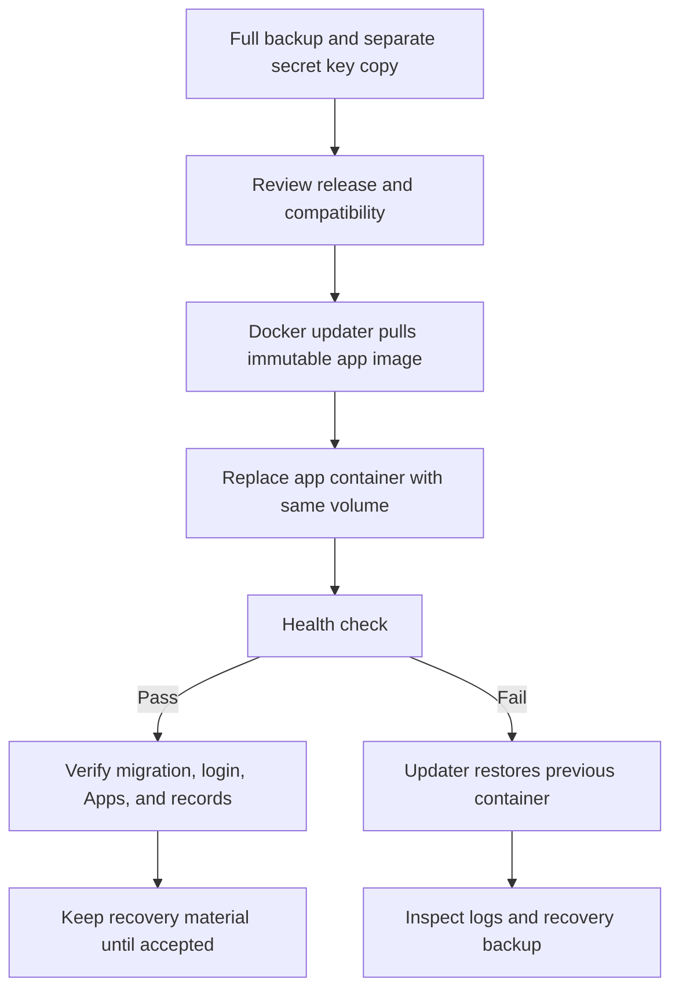

# Update the framework

## Purpose

Install a newer stable Docker image while preserving the named data volume and a verified recovery point.

## Audience

Framework administrators and Docker operators.

## Update flow


```mermaid
flowchart TD
    A[Full backup and separate secret key copy] --> B[Review release and compatibility]
    B --> C[Docker updater pulls immutable app image]
    C --> D[Replace app container with same volume]
    D --> E[Health check]
    E -->|Pass| F[Verify migration, login, Apps, and records]
    E -->|Fail| G[Updater restores previous container]
    G --> H[Inspect logs and recovery backup]
    F --> I[Keep recovery material until accepted]
```

## Web procedure

1. Confirm both Compose services are healthy and the app can reach `http://updater:3400`.
2. Export a Full `.emubackup` and copy `/data/.emu-secret.key` (or `EMU_SECRET_KEY_PATH`) to separate secure storage.
3. Sign in with `FW_SystemAdminRole`, open **Settings → System Maintenance**, and run database diagnostics.
4. Choose **Check for updates**, review the target version and release notes, then start the update.
5. Keep the page open while the app reconnects. Confirm the job reaches `succeeded`.
6. Verify login, recent business records, Designer metadata, important Scripts/Functions, reports, integrations, and database diagnostics.

The app creates a validated pre-update `.emubackup` under `/data/backups` before dispatching the job. The updater sidecar pulls the target image, recreates the app container with the existing configuration and `/data` volume, and waits for a health check. If the new container is unhealthy, it attempts to restore the previous container image.

Container rollback does not reverse database migrations. Keep the pre-update backup and secret key until the new version and its data are accepted.

## Upgrade to v0.5.0.0

1. Stop the older application and confirm no process or second container can write `data.db` or `designer.db`.
2. Preserve both databases and `.emu-secret.key`; the key is intentionally excluded from `.emubackup`.
3. Set `EMU_VERSION=0.5.0.0` and use the current `docker-compose.yml`, which runs both `app` and `updater` services.
4. Start the stack and allow the idempotent metadata and index migrations to finish.
5. Review Form Extensions with Lines, large Designer workspaces, paginated reports, and the AI Proposal Inbox.
6. Verify **System Maintenance** reports WAL mode, foreign keys, lock timeout, checkpoints, and successful integrity checks for both databases.

v0.5.0.0 removes the production Windows host, user CLI, MCP package, launchers, installers, and host update/restore scripts. Do not copy those components forward from an older release. Production is Docker-only.

The release preserves documented v0.1.x metadata, Function, Script, backup, and synchronous `DataContext` compatibility. Direct access to private SQLite handles such as `kernel.db.prepare()` must be reviewed and migrated to supported framework APIs.

## Manual Docker fallback

If the Web procedure cannot start but the existing app is still healthy:

```sh
docker compose pull
docker compose up -d --force-recreate
docker compose ps
docker compose logs --tail=200 app updater
```

Set `EMU_VERSION` to an explicit stable tag before pulling. Reuse the same named `/data` volume, environment, network, and updater token. Do not run `docker compose down -v`.

## Related topics

[Backup](backup.md) · [Docker operations](docker-operations.md) · [Recovery](recovery.md) · [Release notes](../release-notes.md)
