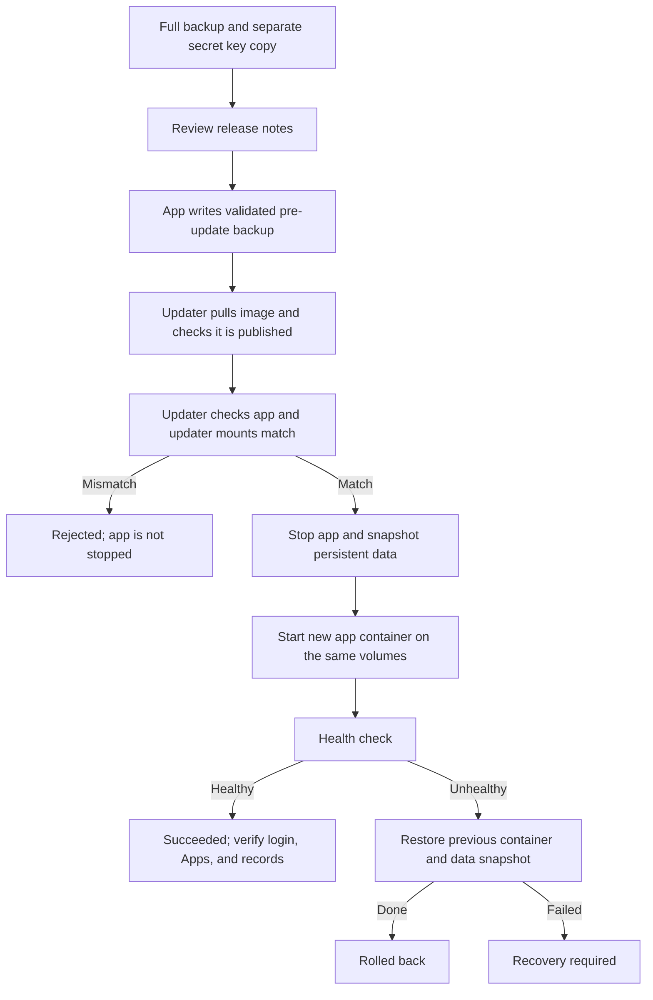

# Update the framework

## Purpose

Install a newer stable Docker image while preserving the data volumes and a verified recovery point.

## Audience

Framework administrators and Docker operators.

## Prerequisites

- A running Compose stack with the `app` and `updater` services, both healthy.
- The `emu-data`, `emu-files`, and `emu-archive` volumes mounted into **both** containers. See [Install with Docker](docker-install.md).
- Free disk space for the pre-update backup and a snapshot of the data volumes. Before an update the updater copies the databases, secret key, fonts, attachment files, and archive so it can roll back; plan headroom beyond the current usage (see [Manage storage and archiving](storage-and-archive.md)).

## Version rules

Releases use `Major.Minor.Patch`. An **FU** (Framework Update) adds functionality or changes structure; a **PU** (Proactive Update) contains fixes. See the [release notes](../release-notes.md) for the type of each release.

- The update target must be a stable `X.Y.Z` version. The updater rejects anything else, including `latest` and legacy four-component tags such as `0.5.0.0`.
- The web update installs the latest stable release published on GitHub. To install a specific version, use the manual fallback below.
- Update the app image and the updater image together to the same version.

## Update flow


```mermaid
flowchart TD
    A[Full backup and separate secret key copy] --> B[Review release notes]
    B --> C[App writes validated pre-update backup]
    C --> D[Updater pulls image and checks it is published]
    D --> E[Updater checks app and updater mounts match]
    E -->|Mismatch| X[Rejected; app is not stopped]
    E -->|Match| F[Stop app and snapshot persistent data]
    F --> G[Start new app container on the same volumes]
    G --> H[Health check]
    H -->|Healthy| I[Succeeded; verify login, Apps, and records]
    H -->|Unhealthy| J[Restore previous container and data snapshot]
    J -->|Done| K[Rolled back]
    J -->|Failed| L[Recovery required]
```

## Web procedure

1. Confirm both Compose services are healthy and the app can reach `http://updater:3400`.
2. Export a Full `.emubackup` and copy `/data/.emu-secret.key` (or `EMU_SECRET_KEY_PATH`) to separate secure storage.
3. Sign in with `FW_SystemAdminRole`, open **Settings → System Maintenance**, and run database diagnostics.
4. Read the release notes for every version between yours and the target, including any breaking changes.
5. Choose **Check for updates**, review the target version, then choose **Update to latest stable** and confirm **Create backup and update**.
6. Keep the page open while the app reconnects. Confirm the job reaches `succeeded` with phase `completed`.
7. Verify login, recent business records, Designer metadata, important Scripts and Functions, reports, attachments, integrations, and database diagnostics.
8. Bring the updater image to the same version (see below).

The app creates a validated pre-update `.emubackup` named `before-update-<version>-<timestamp>.emubackup` under `/data/backups` before it dispatches the job. The update is refused if the secret key file does not exist, if another update is already running, or if the framework is already up to date.

The web update replaces the **app** container only. The updater sidecar keeps running its current image, so after the update succeeds set `EMU_VERSION` in `.env` to the new version and run:

```sh
docker compose pull
docker compose up -d
```

## What the updater checks and does

| Phase | What happens |
|---|---|
| `preparing` | Pulls the target image and confirms it is published. An unpublished image is rejected with "Container image ... is not published. No container was changed." Then compares the app and updater mounts. |
| `stopping` | Stops the app container. |
| `snapshotting` | Copies `data.db`, `designer.db`, the secret key, fonts, attachment files, and archive into a recovery folder. |
| `switching` | Renames the old container, then creates and starts the new one with the same configuration, volumes, and network. |
| `verifying` | Waits for the new container's health check to pass. |
| `completed` | The update succeeded. The rollback container and snapshot are removed. |

The job status moves through `pending`, `running`, `restarting`, and `succeeded` or `failed`. The status file also records `phase`, `rollbackStatus` (`not_required`, `running`, `succeeded`, `failed`), and `recoveryRequired`.

### Mount check

If `EMU_FILE_STORAGE_PATH` or `EMU_ARCHIVE_STORAGE_PATH` points outside `/data`, the updater requires the app and updater to mount the **same** source at that path. If a mount is missing or differs, the update stops before the app is touched and the job fails with `Persistent mount '/files' is missing or differs between app and updater; application was not stopped`. Fix the Compose file or container mounts and recreate both containers. Installations that still use `/data/files` and `/data/archive` need no extra mount.

### Rollback and recovery

If the new container is not healthy, or the switch fails after the app was stopped, the updater:

1. Sets the phase to `rolling_back`.
2. Removes the new container and restores the data snapshot taken before the update.
3. Renames and restarts the previous container and waits for it to be healthy.
4. Ends with phase `rolled_back`, `rollbackStatus` `succeeded`, and the job status `failed` with the original error.

Because the snapshot is restored, a failed update leaves your data as it was before the attempt. If the rollback itself fails, the job shows phase `recovery_required` with `recoveryRequired` true, and the snapshot is kept in `/data/update-recovery-<job id>`. The System Maintenance page shows **Administrator recovery required**. Follow [Recover from a failed update](recovery.md).

If the updater is restarted or crashes during a job, it detects the interrupted job on startup, compensates the unfinished phase, restarts the app where possible, and marks the job failed with an explanation.

Rolling back an update that **succeeded** is different: switching back to an older image does not undo database migrations. Keep the pre-update backup and secret key until the new version and its data are accepted.

### Health checks

The app image reports health from `/api/health`, and the updater image from `http://127.0.0.1:3400/health`. Compose shows both in `docker compose ps`. The updater health response includes `busy`, which is true while an update or restore runs.

## Upgrade notes by release

| Upgrading to | Before you start |
|---|---|
| 1.4.0 | Review Scripts: `initValue`, `validateWrite`, `validateDelete`, and data event handlers must be synchronous. Move awaited or external work into an async Function. |
| 1.3.0 | Back up `data.db` and `designer.db` together. License tables are added to `designer.db` automatically; existing Models stay unlicensed. |
| 1.1.0 | Add the `emu-files` and `emu-archive` volumes and the two storage variables to both services. See [Add file and archive volumes](docker-install.md#add-file-and-archive-volumes-to-an-existing-installation). Existing installations still boot with `/data/files` and `/data/archive` and show a warning. |
| 1.0.2 | No migration. Restore, update, and recovery use the phase-based journal. |

The release notes describe upgrade checks against the immediately preceding release. When you skip releases, read the notes for each skipped release and take a Full backup first.

## Upgrade from v0.5.0.0

1. Stop the older application and confirm no process or second container can write `data.db` or `designer.db`.
2. Preserve both databases and `.emu-secret.key`; the key is intentionally excluded from `.emubackup`.
3. Use the current `docker-compose.yml`, which runs the `app` and `updater` services and the three volumes. Set `EMU_VERSION` to a stable `X.Y.Z` tag such as `1.4.0`.
4. Start the stack and allow the idempotent metadata and index migrations to finish.
5. Check the items in the table above, review Form Extensions with Lines, large Designer workspaces, paginated reports, and the AI Proposal Inbox.
6. Verify **System Maintenance** reports WAL mode, foreign keys, lock timeout, checkpoints, and successful integrity checks for both databases.

Version 0.5.0.0 removed the production Windows host, user CLI, MCP package, launchers, installers, and host update and restore scripts. Do not copy those components forward from an older release. Production is Docker-only. Direct access to private SQLite handles such as `kernel.db.prepare()` must be reviewed and migrated to supported framework APIs.

## Manual Docker fallback

If the web procedure cannot start but the existing app is still healthy, or you need a specific version:

1. Set `EMU_VERSION` in `.env` to an explicit stable `X.Y.Z` tag.
2. Create a Full backup first; the manual path does not create one for you.
3. Run:

   ```sh
   docker compose pull
   docker compose up -d --force-recreate
   docker compose ps
   docker compose logs --tail=200 app updater
   ```

Reuse the same named volumes, environment, network, and updater token. Do not run `docker compose down -v`.

## Related topics

[Backup](backup.md) · [Docker operations](docker-operations.md) · [Recovery](recovery.md) · [Storage and archive](storage-and-archive.md) · [Release notes](../release-notes.md)
