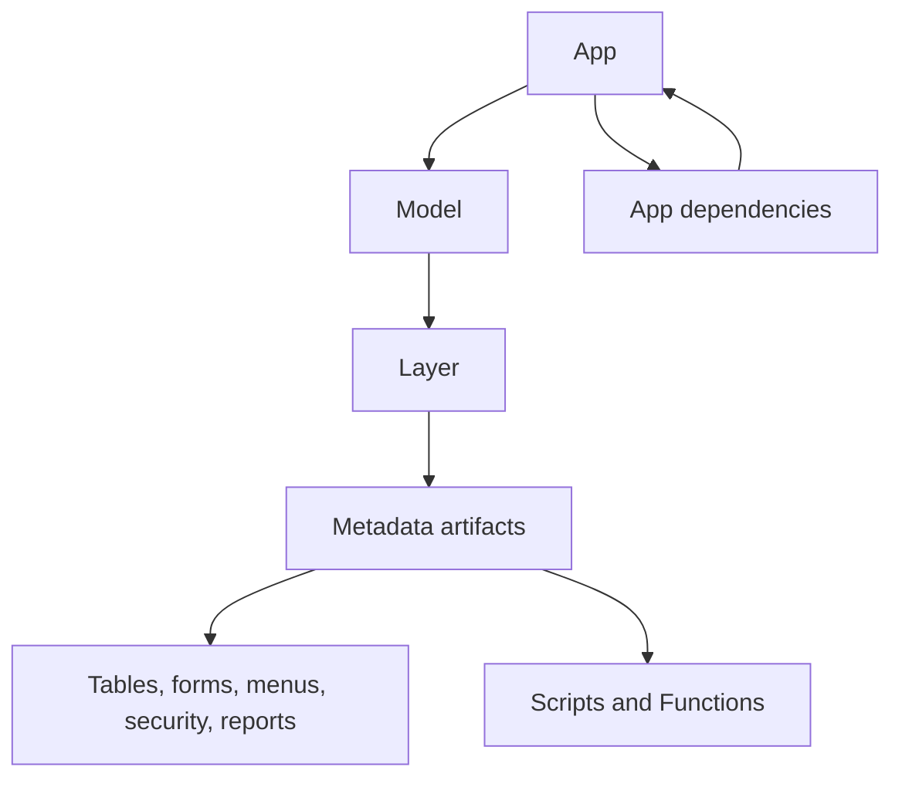
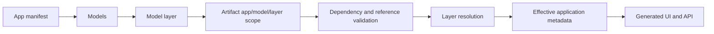

# Understand apps, models, and layers

## Purpose

Understand how an EmuFramework application is organized before creating metadata or customizations.

## Audience

Application developers, ISV developers, customizers, and framework administrators.

## Prerequisites

Basic familiarity with [metadata](metadata.md) and the [application workflow](application-workflow.md).

## The relationship

An **App** is the top-level application boundary. An App contains one or more **Models**, and each Model groups a coherent set of metadata definitions. A **Layer** determines the ownership and precedence of those definitions when the same logical artifact is contributed by multiple sources.



The practical model is:

```text
App
└── Model
    └── Layer
        └── Metadata artifacts
```

An artifact can identify its owning `app`, optional `model`, and optional `layer`. The App establishes scope and dependencies; the Model organizes the app's definitions; the Layer resolves ownership and precedence.

## App

The App manifest defines the application identity, display information, dependencies, and its Models.

```json
{
  "kind": "app",
  "name": "sales",
  "label": "Sales",
  "icon": "grid",
  "dependsOn": [],
  "models": [
    { "name": "SalesCore", "label": "Sales Core", "layer": "DEV" }
  ]
}
```

Use the App boundary to decide what belongs together, what the application depends on, and which users can access it. `dependsOn` also determines load order: the kernel registers apps by walking the dependency graph so a dependency is always registered before any app that depends on it, and this now also governs whether a cross-app Extension is allowed (see [Extensions](extensions.md)).

## Model

A Model is a named grouping within an App. Use Models to separate coherent areas of an application, such as core sales definitions, reporting definitions, or a customer-specific customization set. A Model can carry its own layer assignment in the App manifest, while individual artifacts may also specify ownership and layer according to the metadata contract.

Keep references within the correct App and Model scope. Create the Model and its foundational definitions before forms, menus, security artifacts, Scripts, or Functions that depend on them.

## Layer

Layers describe where a Model or artifact comes from and which definition takes precedence:

```text
SYS < ISV < LOC < DEV < CUS
```

| Layer | Typical owner | Typical use |
| --- | --- | --- |
| `SYS` | Framework | Core system definitions |
| `ISV` | Vendor or product team | Reusable product definitions |
| `LOC` | Localization or site team | Local or regional changes |
| `DEV` | Development team | Development customizations |
| `CUS` | Customer or implementation team | Customer-specific customizations |

Base artifacts at a higher layer override lower-layer artifacts with the same logical identity. Extensions accumulate into their target instead of replacing it. See [Work with metadata layers](layers.md) for the detailed precedence rules.

## Resolution flow



## Recommended design

1. Define the App and its dependencies.
2. Define Models that represent coherent application areas.
3. Assign the appropriate Model layer and ownership.
4. Add enums, tables, and references.
5. Add forms, menus, reports, and security.
6. Add Hooks, Scripts, and Functions in the same App/Model scope.
7. Use Extensions for additive changes to an existing App/Model.
8. Validate the effective result at runtime and test each relevant layer.

## Common mistakes

- Treating an App as if it has no Model boundary.
- Putting a customization in a product layer instead of `LOC`, `DEV`, or `CUS`.
- Referencing an artifact from another App or Model without declaring the dependency.
- Replacing a base artifact when an Extension should have been used.
- Assuming a Model or Layer automatically grants security access; permissions still require explicit security metadata.

## Related topics

[Application workflow](application-workflow.md) · [Metadata](metadata.md) · [Work with metadata layers](layers.md) · [Extensions](extensions.md) · [Security](security.md)
