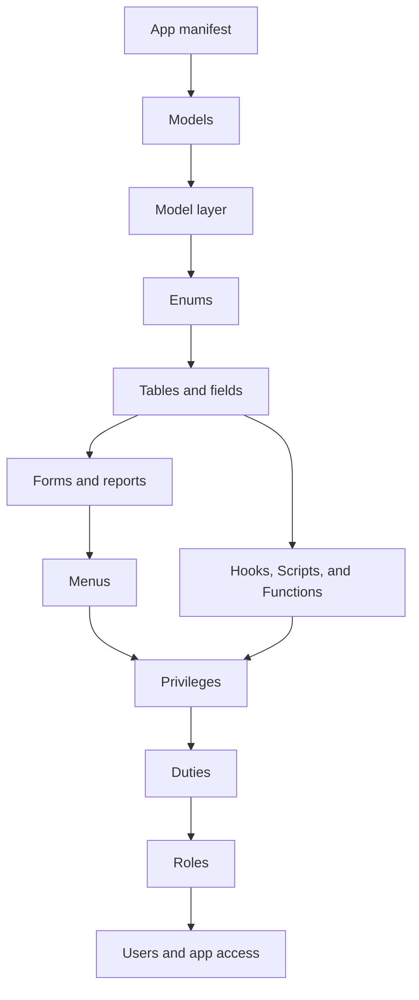

# Build an application

## Purpose

Create a coherent metadata-driven application in the order required by its references, then expose it through forms, menus, permissions, and actions.

## Prerequisites

- A working development environment; see [Set up a development environment](setup.md).
- A stable application name and artifact naming convention.
- A decision about whether metadata is source-controlled or owned by Web Designer.

## Build order

Create the App and Models before the artifacts that use them, then create referenced enums and tables before forms, reports, menus, security, Scripts, or Functions. The registry validates app/model scope and cross-references during application loading.

## Procedure

1. Create the App with the CLI or Web Designer.
2. Define its Models, dependencies, and layer ownership.
3. Define enums, tables, fields, references, and indexes.
4. Define forms, list fields, menus, and reports.
5. Add privileges, duties, roles, and app access.
6. Choose the smallest business-logic mechanism for each rule.
7. Validate metadata, app/model scope, and cross-references.
8. Test generated lists, forms, actions, permissions, and database effects.
9. Export a package or commit the source-controlled metadata.

## Source-controlled versus Web Designer metadata

Use file-based metadata for application definitions that require code review, repeatable deployment, and version control. Use Web Designer for runtime or customer-owned customization. Both paths must obey the same metadata schema, security policy, and extension boundaries.

## Related topics

[Metadata](metadata.md) · [Extensions](extensions.md) · [Functions and actions](functions.md) · [Testing](testing.md)
