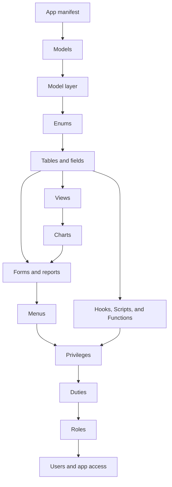

# Build an application

## Purpose

Create a coherent metadata-driven application in the order required by its references, then expose it through forms, menus, permissions, and actions.

## Prerequisites

- A working development environment; see [Set up a development environment](setup.md).
- A stable application name and artifact naming convention.
- A decision about whether metadata is source-controlled or owned by Web Designer.

## Build order

Create the App first; it starts with zero Models. Add and select a Model before any artifact. Then create referenced enums and tables before Views, Charts, Forms, Reports, menus, security, Scripts, or Functions. The registry validates App/Model scope and cross-references during application loading.

## Procedure

1. Create the App with the CLI or Web Designer and verify that it has no implicit Model.
2. Add its Models, dependencies, and Layer ownership explicitly.
3. Define enums, tables, fields, references, and indexes.
4. Define Views and Charts when the App needs reusable queries or visualizations.
5. Define Forms, list fields, embedded Charts, menus, and Reports.
6. Add Privileges (including Views), Duties, Roles, and App Access.
7. Choose the smallest business-logic mechanism for each rule.
8. Validate metadata, App/Model scope, and cross-references.
9. Test generated lists, Forms, Charts, actions, permissions, and database effects.
10. Export a package or commit the source-controlled metadata.

## Source-controlled versus Web Designer metadata

Use file-based metadata for application definitions that require code review, repeatable deployment, and version control. Use Web Designer for runtime or customer-owned customization. Both paths must obey the same metadata schema, security policy, and extension boundaries.

## Related topics

[Metadata](metadata.md) · [Views and Charts](views-and-charts.md) · [Security](security.md) · [Extensions](extensions.md) · [Functions and actions](functions.md) · [Testing](testing.md)
