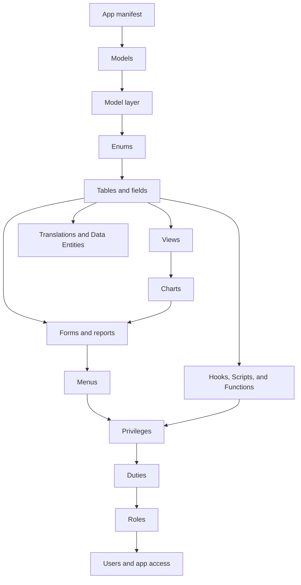

# Build an application

## Purpose

Create a coherent metadata-driven application in the order required by its references, then expose it through forms, menus, permissions, and actions.

## Prerequisites

- A working development environment; see [Set up a development environment](setup.md).
- A stable application name and artifact naming convention.
- A decision about how App/Model package exports will be reviewed and promoted between environments.

## Build order

```mermaid
flowchart TD
    A[App manifest] --> M[Models]
    M --> L[Model layer]
    L --> B[Enums]
    B --> C[Tables and fields]
    C --> V[Views]
    V --> Z[Charts]
    C --> D[Forms and reports]
    Z --> D
    D --> E[Menus]
    E --> F[Privileges]
    F --> G[Duties]
    G --> H[Roles]
    H --> I[Users and app access]
    C --> T[Translations and Data Entities]
    C --> J[Hooks, Scripts, and Functions]
    J --> F
```

Create the App first; it starts with zero Models. Add and select a Model before any artifact. Then create referenced enums and tables before Views, Charts, Forms, Reports, menus, security, Scripts, or Functions. The registry validates App/Model scope and cross-references during application loading.

## Procedure

1. Create the App with Web Designer and verify that it has no implicit Model. AI tokens can target only Apps that already exist.
2. Add its Models, dependencies, and Layer ownership explicitly.
3. Define enums, tables, fields, references, and indexes.
4. Define Views and Charts when the App needs reusable queries or visualizations.
5. Define Forms, list fields, embedded Charts, menus, and Reports.
6. Add Privileges (including Views), Duties, Roles, and App Access.
7. Optionally add [Translations](localization.md) and set the App `defaultLocale`, and add [Data Entities](data-entities.md) for documents that users exchange as spreadsheets.
8. Choose the smallest business-logic mechanism for each rule. Keep hooks and events synchronous and put awaited work in async Functions; see [Record lifecycle](record-lifecycle.md).
9. Validate metadata, App/Model scope, and cross-references.
10. Test generated lists, Forms, new-record drafts, Charts, actions, permissions, and database effects.
11. Export an App or Model package, or a [selected-model deployment package](model-deployment.md), and commit it when the metadata needs source review or promotion.

## Review and promotion

Use Web Designer for human authoring and reviewed AI REST proposals for automated assistance inside an existing App. Export App or Model packages when definitions require code review and version control. Use selected-model packages, in `vendor` or `promotion` mode, to move several Models between installations; business data, users, and licenses are not part of a package. Every path obeys the same metadata schema, security policy, and Extension boundaries.

## Related topics

[Metadata](metadata.md) · [Views and Charts](views-and-charts.md) · [Security](security.md) · [Extensions](extensions.md) · [Functions and actions](functions.md) · [Localization](localization.md) · [Data Entities](data-entities.md) · [Model deployment](model-deployment.md) · [Testing](testing.md)
