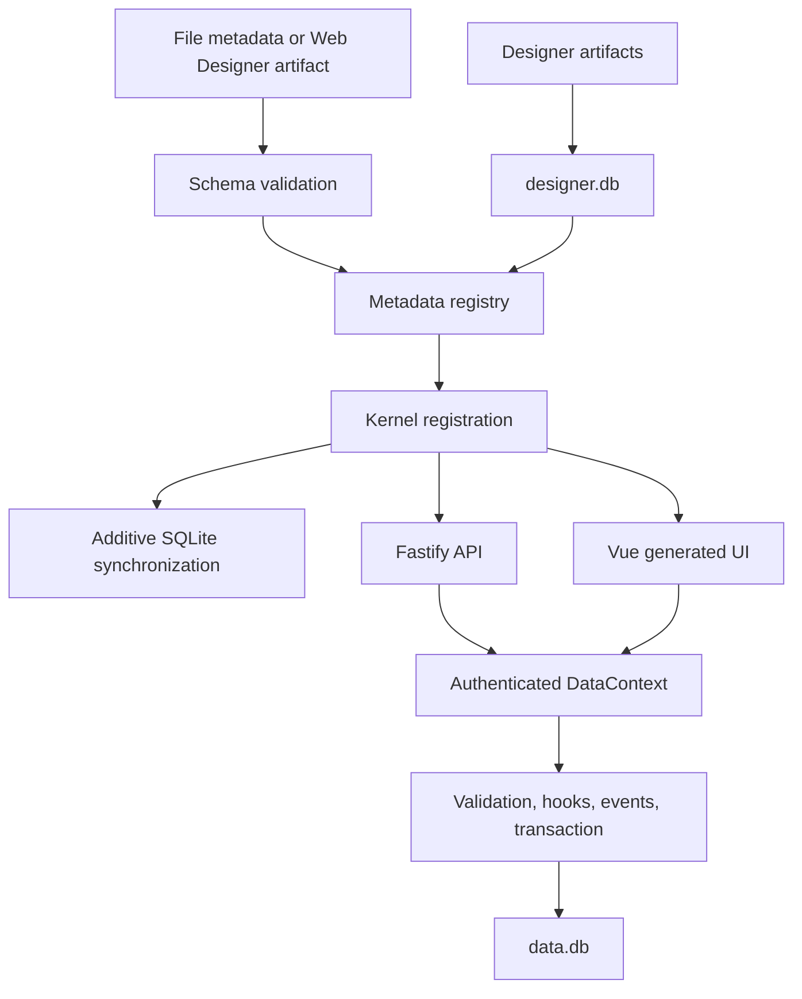

# Understand the architecture

## Purpose

Understand how metadata becomes a secured application and where application behavior belongs.

## Audience

Developers and framework maintainers.

## Prerequisites

Basic familiarity with TypeScript, SQLite, and metadata-driven applications.

## Runtime flow

## Runtime layers

EmuFramework is a pnpm workspace with four runtime layers: core metadata and database services, the Fastify API, the Vue client, and application metadata. The CLI scaffolds metadata, while the MCP package exposes development context to compatible AI tools.

The kernel loads code metadata, synchronizes additive SQLite schema changes, loads Designer artifacts, registers business logic, and enforces security. `data.db` stores business and system records; `designer.db` stores browser-created artifacts.

## Design rules

- Route every data operation through the framework data layer.
- Extend applications through metadata, hooks, events, Scripts, Functions, and declared dependencies.
- Do not edit generated database structure manually.
- Treat client visibility as usability, not authorization.

## Related topics

[Metadata](metadata.md) · [Business logic](business-logic.md) · [Extensions](extensions.md)
