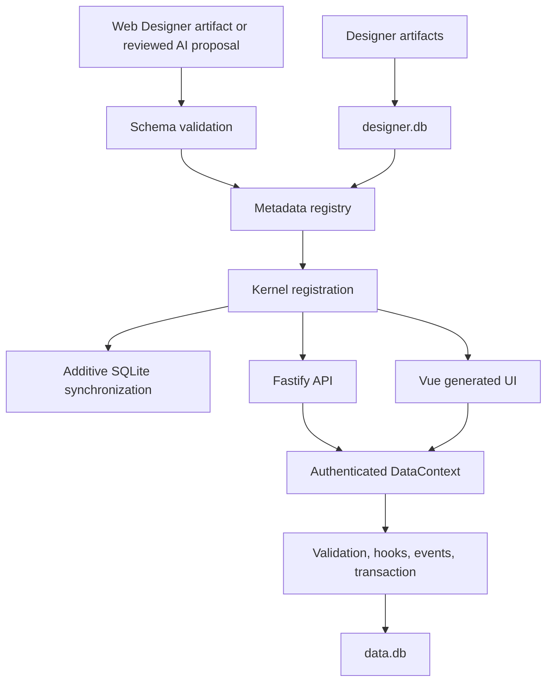

# Understand the architecture

## Purpose

Understand how metadata becomes a secured application and where application behavior belongs.

## Audience

Developers and framework maintainers.

## Prerequisites

Basic familiarity with TypeScript, SQLite, and metadata-driven applications.

## Runtime flow

```mermaid
flowchart TD
    A[Web Designer artifact or reviewed AI proposal] --> B[Schema validation]
    B --> C[Metadata registry]
    C --> D[Kernel registration]
    D --> E[Additive SQLite synchronization]
    D --> F[Fastify API]
    D --> G[Vue generated UI]
    F --> H[Authenticated DataContext]
    G --> H
    H --> I[Validation, hooks, events, transaction]
    I --> J[data.db]
    K[Designer artifacts] --> L[designer.db]
    L --> C
```

## Runtime layers

EmuFramework is a pnpm workspace with three packages: `@emu/core` for metadata, SQLite access, schema synchronization, and security; `@emu/server` for Fastify APIs and runtime services; and `@emu/client` for the Vue application and Web Designer.

The kernel resolves metadata with a single-pass dependency pipeline, reuses content-hash results, synchronizes only affected tables, registers business logic, and enforces security. `data.db` stores business and system records; `designer.db` stores browser-created Artifacts, Designer state, AI tokens, proposals, and audit records.

Beyond metadata and records, the server also owns several stores that are not business tables. Attachment content lives on a file volume (`EMU_FILE_STORAGE_PATH`) with catalog rows in `data.db`, archived documents live in an immutable archive volume (`EMU_ARCHIVE_STORAGE_PATH`) with their own catalog, and in-progress record drafts and Data Entity import jobs are stored durably so they survive a restart. Installation identity, trusted vendor keys, and installed ISV licenses live in `designer.db` and never travel in a metadata package.

Lifecycle hooks and data events run synchronously inside the write transaction. Work that must await, such as HTTP or email, belongs to an async Function. A new record is created from a server-held draft rather than an inserted placeholder row; see [Understand the record lifecycle](record-lifecycle.md). Labels are localized per request by a layer-aware resolver, described in [Localize metadata with Translations](localization.md).

Production execution is Docker-only. Local Node.js commands are for framework development and verification, not for running a production host.

## Design rules

- Route every data operation through the framework data layer.
- Extend applications through metadata, hooks, events, Scripts, Functions, and declared dependencies.
- Do not edit generated database structure manually.
- Treat client visibility as usability, not authorization.
- Keep lifecycle handlers synchronous and deterministic; move awaited or external work to async Functions.
- Keep installation state (identity, keys, licenses) out of metadata and packages.

## Related topics

[Metadata](metadata.md) · [Business logic](business-logic.md) · [Extensions](extensions.md) · [Record lifecycle](record-lifecycle.md) · [Model deployment](model-deployment.md)
