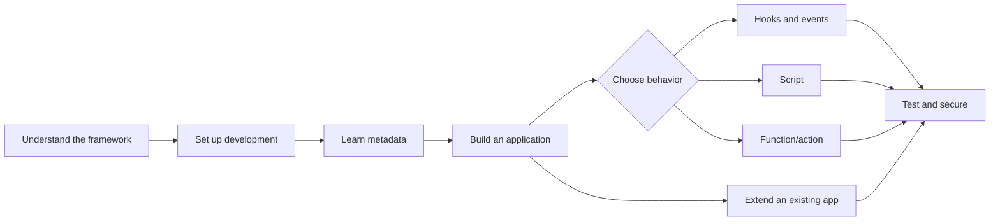

# Developer documentation overview

This page is the entry point for developing applications and extensions with EmuFramework. It preserves the original development-guide URL while directing readers to focused Microsoft Docs–style pages.

## Learning path

## Overview

- [Framework architecture](architecture.md)
- [Set up a development environment](setup.md)
- [Use the CLI](cli.md)

## Concepts

- [Work with metadata](metadata.md)
- [Understand Apps, Models, and Layers](app-model-layer.md)
- [Work with metadata layers](layers.md)
- [Build an application](application-workflow.md)
- [Create extensions](extensions.md)
- [Use hooks and data events](hooks-events.md)

## How-to guides

- [Develop Scripts](scripts.md)
- [Develop Functions and actions](functions.md)
- [Add business logic](business-logic.md)
- [Use the Web Designer](../user/web-designer.md)

## Security, testing, and operations

- [Understand security](security.md)
- [Run tests and debug](testing.md)
- [Review future major dependency upgrades](dependency-upgrades.md)
- [Use AI and MCP tools](ai-mcp.md)

## Documentation conventions

Each topic identifies prerequisites, the supported workflow, examples, security considerations, testing expectations, and related topics. Metadata names are stable identifiers; labels are user-facing text. When implementation details change, update the focused topic and its examples first, then update this index.
