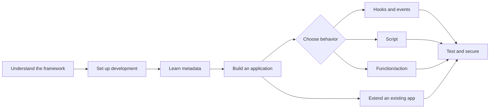

# Developer documentation overview

This page is the entry point for developing applications and extensions with EmuFramework v1.4.0. It preserves the original development-guide URL while directing readers to focused Microsoft Docs–style pages.

## Learning path

```mermaid
flowchart LR
    A[Understand the framework] --> B[Set up development]
    B --> C[Learn metadata]
    C --> D[Build an application]
    D --> E{Choose behavior}
    E --> F[Hooks and events]
    E --> G[Script]
    E --> H[Function/action]
    D --> I[Extend an existing app]
    F --> J[Test and secure]
    G --> J
    H --> J
    I --> J
```

## Overview

- [Framework architecture](architecture.md)
- [Set up a development environment](setup.md)

## Concepts

- [Work with metadata](metadata.md)
- [Create Artifacts through the API](artifact-api.md)
- [Artifact kind reference](artifact-types.md)
- [Nested metadata structures](artifact-components.md)
- [Understand Apps, Models, and Layers](app-model-layer.md)
- [Work with metadata layers](layers.md)
- [Build an application](application-workflow.md)
- [Build Views and embedded Charts](views-and-charts.md)
- [Design paginated Reports](reports.md)
- [Create extensions](extensions.md)
- [Use hooks and data events](hooks-events.md)
- [Understand the record lifecycle](record-lifecycle.md)
- [Localize metadata with Translations](localization.md)
- [Define Data Entities](data-entities.md)
- [Work with record attachments](attachments.md)
- [Deploy models and license ISV add-ons](model-deployment.md)

## How-to guides

- [Develop Scripts](scripts.md)
- [Develop Functions and actions](functions.md) (including image input)
- [Add business logic](business-logic.md)
- [Use the Web Designer](../user/web-designer.md)

## Security, testing, and operations

- [Understand security](security.md)
- [Run tests and debug](testing.md)
- [Review future major dependency upgrades](dependency-upgrades.md)
- [Integrate AI through the REST proposal API](ai-rest-api.md)

## Documentation conventions

Each topic identifies prerequisites, the supported workflow, examples, security considerations, testing expectations, and related topics. Metadata names are stable identifiers; labels are user-facing text. When implementation details change, update the focused topic and its examples first, then update this index.
