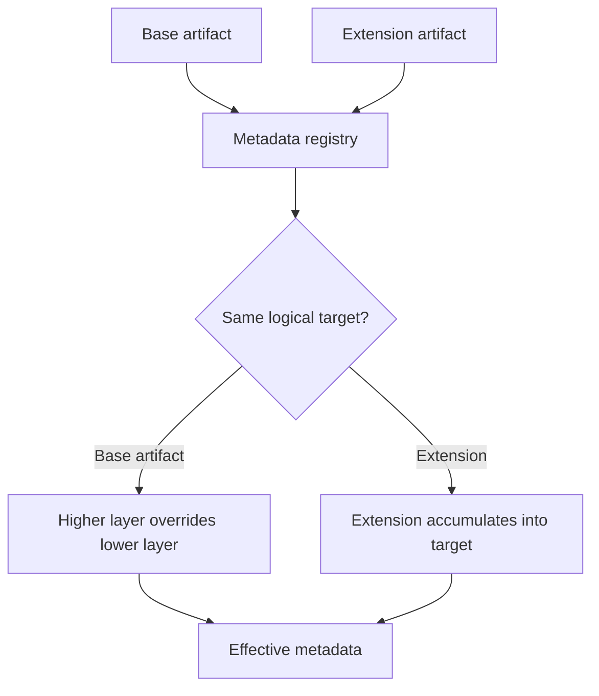

# Create extensions

## Purpose

Add metadata or supported behavior to an existing application without copying or replacing the base artifact.

## When to use an Extension

Use an Extension when a feature must add fields, indexes, form behavior, menu items, permissions, or Script behavior while remaining independently removable. Use a higher-layer base artifact only when you own the complete definition and intend to replace the lower-layer artifact.

## Resolution model



Base artifacts with the same logical identity follow `SYS < ISV < LOC < DEV < CUS`. Extensions accumulate into their target instead of replacing it. See [Work with metadata layers](layers.md) for the complete layer model and ownership guidance.

## Supported Extension kinds

```text
tableExtension, enumExtension, formExtension, menuExtension,
privilegeExtension, dutyExtension, roleExtension, scriptExtension
```

The target property matches the kind: `table`, `enum`, `form`, `menu`, `privilege`, `duty`, `role`, or `script`.

## Prerequisites

- A target application and its declared dependency.
- A unique Extension name.
- Knowledge of the target artifact and its layer.
- A backup before applying destructive schema effects.

## Procedure

1. Create the Extension with the CLI or define it in Web Designer.
2. Declare the target application dependency.
3. Add only the fields, indexes, menu items, permissions, or behavior required by the feature.
4. Validate target references and the generated change set.
5. Apply the change set or commit the source-controlled metadata.
6. Test with the Extension enabled and disabled.
7. Confirm that removing the Extension leaves the base application understandable and deployable.

## Example

```json
{
  "kind": "tableExtension",
  "name": "SALES_CustomerLocalization",
  "app": "sales",
  "table": "SALES_Customer",
  "layer": "LOC",
  "fields": [
    { "name": "localName", "type": "string", "label": "Local name" }
  ],
  "indexes": [
    { "name": "SALES_CustomerLocalNameIdx", "fields": ["localName"] }
  ]
}
```

## File-based and Web Designer Extensions

Use file-based Extensions for reviewed, repeatable, source-controlled application definitions. Use Web Designer for runtime or customer-owned customization. Both forms use the same schema and must remain independently removable.

## Naming, ordering, and removal

Names are stable identifiers and must be unique. Do not overwrite framework files or rely on undocumented registration order. Declare dependencies explicitly, use the appropriate layer, and avoid duplicate action names. An Extension should be removable without copying the base app or leaving orphaned references.

## Security and schema considerations

Extension metadata can add privileges, Functions, and Scripts, but it does not bypass authorization. Review permissions as carefully as code. Adding tables, fields, and indexes is supported by additive synchronization; removing or changing existing structures requires a migration and backup strategy.

## Testing

Validate schema and cross-references, test generated forms/lists/menus, verify authorization, test import/export when packageable, and run the feature with other Extensions enabled and disabled.

## Related topics

[Application workflow](application-workflow.md) · [Metadata](metadata.md) · [Scripts](scripts.md) · [CLI](cli.md) · [Security](security.md)
