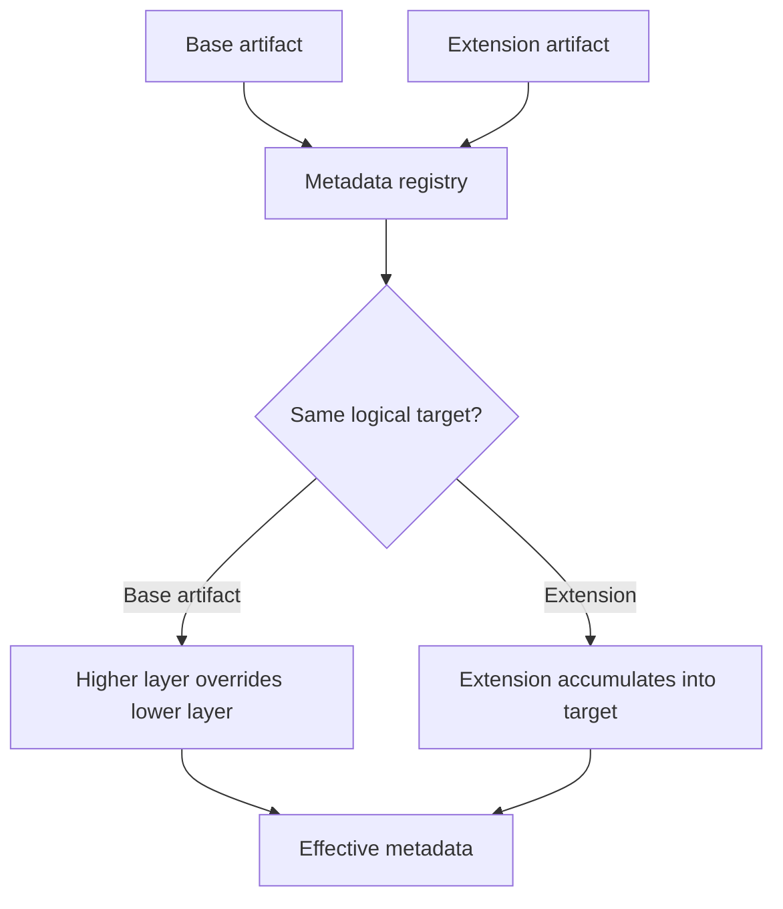

# Create extensions

## Purpose

Add metadata or supported behavior to an existing application without copying or replacing the base artifact.

## When to use an Extension

Use an Extension when a feature must add fields, indexes, form behavior, menu items, permissions, or Script behavior while remaining independently removable. Use a higher-layer base artifact only when you own the complete definition and intend to replace the lower-layer artifact.

## Resolution model


```mermaid
flowchart TD
    A[Base artifact] --> C[Metadata registry]
    B[Extension artifact] --> C
    C --> D{Same logical target?}
    D -->|Base artifact| E[Higher layer overrides lower layer]
    D -->|Extension| F[Extension accumulates into target]
    E --> G[Effective metadata]
    F --> G
```

Base artifacts with the same logical identity follow `SYS < ISV < LOC < DEV < CUS`. Extensions accumulate into their target instead of replacing it. See [Work with metadata layers](layers.md) for the complete layer model and ownership guidance.

## Supported Extension kinds

```text
tableExtension, enumExtension, formExtension, menuExtension,
privilegeExtension, dutyExtension, roleExtension, scriptExtension,
viewExtension, chartExtension, functionExtension, dataEntityExtension
```

The target property matches the kind: `table`, `enum`, `form`, `menu`, `privilege`, `duty`, `role`, `script`, `view`, `chart`, `function`, or `dataEntity`.

There is no extension kind for Reports or Translations in v1.4.0. Replace a Report with a higher-Layer `report` of the same name. Add or correct wording with another `translation`; for one key and locale the higher Layer wins (see [Localize metadata with Translations](localization.md)).

## Delta and presentation overrides

An Extension stores only the current Layer delta. Inherited metadata remains read-only. Use additive arrays for new fields, indexes, groups, actions, lines, joins, columns, measures, permissions, or behavior; use an override array for presentation changes:

| Extension | Override collection | Supported changes |
| --- | --- | --- |
| `tableExtension` | `fieldOverrides` | field label, create/update editability, `readOnly`, `multiline`, and `encrypted` |
| `enumExtension` | `valueOverrides` | enum-value label |
| `formExtension` | `elementOverrides` | group/action/Chart/line label, visibility, and order by stable `targetId` |
| `menuExtension` | `itemOverrides` | menu label, icon, visibility, and order by stable `targetId` |
| `viewExtension` | `columnOverrides` | output-column label |
| `chartExtension` | `measureOverrides` | measure label and color |

Form groups, actions, Charts, lines, and menu items should have stable `id` values. Target those IDs rather than array positions so a lower-layer insertion or reordering does not redirect a customization.

Form Line editing also uses `lineOverrides`. It can override inherited fields, aggregates, actions, label, visibility, and order, or add a new Line grid while saving only the current Layer delta.

`dataEntityExtension` is purely additive. It appends root fields, new lines, or extra fields on an existing line of a Data Entity, and it can never change the root table, business key, line relationships, or archive settings. Import, export, archive, and restore read the merged entity. Add the underlying Table fields through a `table` or `tableExtension` first. See [Define Data Entities](data-entities.md#extend-a-data-entity).

`functionExtension` supplies Chain-of-Command code. Call `next(args)` to continue the inherited implementation; review it as executable code and test both the extended and base paths.

## Prerequisites

- A target application and its declared dependency.
- A unique Extension name.
- Knowledge of the target artifact and its layer.
- A backup before applying destructive schema effects.

## Procedure

1. Create the Extension in Web Designer or submit it through a reviewed AI proposal.
2. Declare the target application dependency.
3. Add only the fields, indexes, menu items, permissions, or behavior required by the feature.
4. Validate target references and the generated change set.
5. Apply the ChangeSet and export the App/Model package when it requires source review or promotion.
6. Test with the Extension enabled and disabled.
7. Confirm that removing the Extension leaves the base application understandable and deployable.

## Example

```json
{
  "kind": "tableExtension",
  "name": "SALES_CustomerLocalization",
  "app": "sales",
  "table": "SALES_Customer",
  "layer": "LOC",
  "fields": [
    { "name": "localName", "type": "string", "label": "Local name" }
  ],
  "indexes": [
    { "name": "SALES_CustomerLocalNameIdx", "fields": ["localName"] }
  ]
}
```

## Review and promotion

Create Extensions in Web Designer or submit them through a reviewed AI proposal. Export the containing App or Model package for a repeatable, source-controlled promotion. Every form uses the same schema and the Extension must remain independently removable.

## Naming, ordering, and removal

Names are stable identifiers and must be unique. The canonical form is `<AppPrefix>_<ModelName>_<BaseName>_Extension`; Web Designer derives this from the extending App, source Model, and target Artifact. The v0.1.4.0 migration renames an older `<AppPrefix>_<BaseName>_Extension` form when the canonical target is unambiguous and available. A legacy name that cannot be migrated remains supported with a registry/change-set warning so it can be addressed deliberately.

Only one Extension of a given kind may target the same base artifact from the same app and Model; the registry rejects a second `tableExtension`, `formExtension`, and so on for an identical `(app, model, kind, target)` combination.

During the v0.1.4.0 upgrade, the framework adds stable IDs where needed, normalizes legacy field rules, and renames a legacy Extension to its canonical name only when safe. It keeps audit copies and records the migration once; review diagnostics instead of manually rerunning it.

An Extension's `layer` must be strictly higher than the target artifact's layer — extending at the same layer as the target is rejected. When the target belongs to a different app, that dependency must be declared (directly or transitively) in the extending app's `dependsOn`; the registry now validates this at load time instead of relying on convention.

Do not overwrite framework files or rely on undocumented registration order. Declare dependencies explicitly, use the appropriate layer, and avoid duplicate action names. An Extension should be removable without copying the base app or leaving orphaned references.

## Security and schema considerations

Extension metadata can add privileges, Functions, and Scripts, but it does not bypass authorization. Review permissions as carefully as code. Adding tables, fields, and indexes is supported by additive synchronization; removing or changing existing structures requires a migration and backup strategy.

## Testing

Validate schema and cross-references, test generated forms/lists/menus, verify authorization, test import/export when packageable, and run the feature with other Extensions enabled and disabled.

## Related topics

[Application workflow](application-workflow.md) · [Data Entities](data-entities.md) · [Metadata](metadata.md) · [Scripts](scripts.md) · [AI REST API](ai-rest-api.md) · [Security](security.md) · [Customization checklist](customization-checklist.md)
