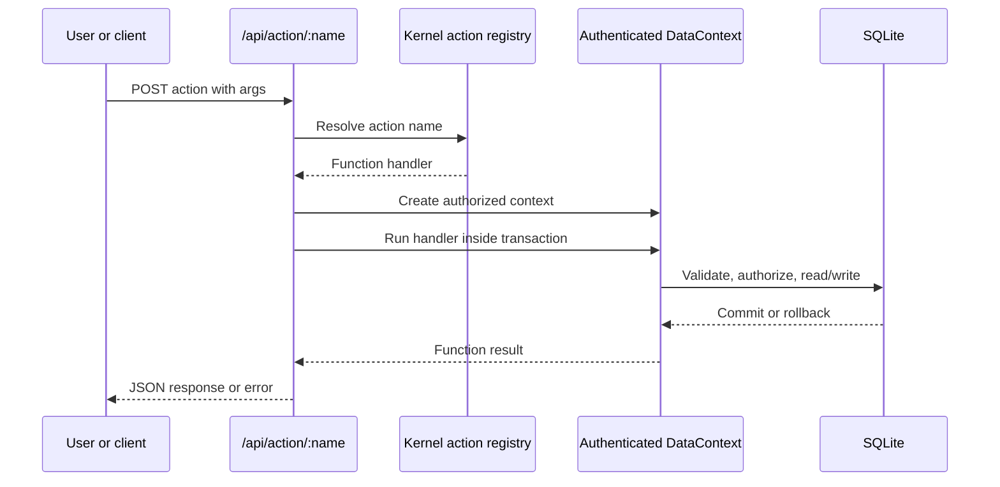

# Develop Functions and actions

## Purpose

Implement an explicit server-side operation that can be invoked by a form action or the named action API.

## When to use a Function

Use a Function for a named operation such as posting an order, recalculating totals, approving a record, or allocating stock. Use hooks/events for lifecycle behavior and [Scripts](scripts.md) for registration of several related handlers.

## Request flow



## Prerequisites

- A table, form, or other metadata target for the operation.
- A privilege that includes the Function.
- A test user with both allowed and denied permissions.

## Function metadata

```json
{
  "kind": "function",
  "name": "SALES_PostOrder",
  "app": "sales",
  "label": "Post order",
  "code": "const orderId = Number(args.orderId); const order = ctx.find('SALES_Order', orderId); if (!order) throw new Error('Order not found'); if (order.f.status !== 1) throw new Error('Only open orders can be posted'); order.set('status', 2).update(); return { ok: true, orderId };"
}
```

The body is invoked with `(ctx, args, kernel)`:

- `ctx` is the authenticated `DataContext` for the request.
- `args` contains the JSON action arguments.
- `kernel` is the active runtime and registry.

The return value becomes the API response. An `undefined` result is returned as `{ ok: true }`.

## Call a Function from a form

```json
{
  "label": "Post order",
  "type": "function",
  "target": "SALES_PostOrder"
}
```

The endpoint is:

```text
POST /api/action/:name
```

Unknown action names return HTTP 404. The server resolves the action, creates the authenticated context, and runs it transactionally.

## Transactions and data access

Use the supplied context for all reads and writes. The action route already wraps the handler in a transaction. Use `ctx.tts()` for an internal group of writes when the caller does not already provide a transaction; nested calls use savepoints. Any thrown error rolls back the current transaction or savepoint.

```js
return ctx.tts(() => {
  const header = ctx.newRecord('SALES_Order');
  header.setMany({
    orderNumber: String(args.orderNumber),
    status: 1,
    customerId: Number(args.customerId)
  }).insert();

  for (const line of args.lines ?? []) {
    ctx.newRecord('SALES_OrderLine').setMany({
      orderId: header.id,
      productId: Number(line.productId),
      quantity: Number(line.quantity),
      unitPrice: Number(line.unitPrice)
    }).insert();
  }

  return { ok: true, orderId: header.id };
});
```

## Authorization and errors

The Function must be listed in a privilege assigned through a duty or role. Use the authenticated `ctx`; never create an unrestricted context to bypass permissions. Validate access to the target record and return user-correctable problems as `ValidationError`. Do not expose secrets, SQL details, or internal stack traces.

## Security considerations

Functions are dynamic server-side code. Treat them as trusted administrative code, review changes, restrict Designer access, use unique names, and keep external integrations in reviewed TypeScript when possible.

## Testing and troubleshooting

Test successful input, invalid input, missing records, unauthorized users, rollback after a failed related write, and duplicate action names. When a Function fails, verify the exact action name, request `args`, table permissions, record lookup, field types, rollback behavior, and whether a Script registered the same action.

## Related topics

[Scripts](scripts.md) · [Hooks and data events](hooks-events.md) · [Security](security.md) · [Testing](testing.md)
