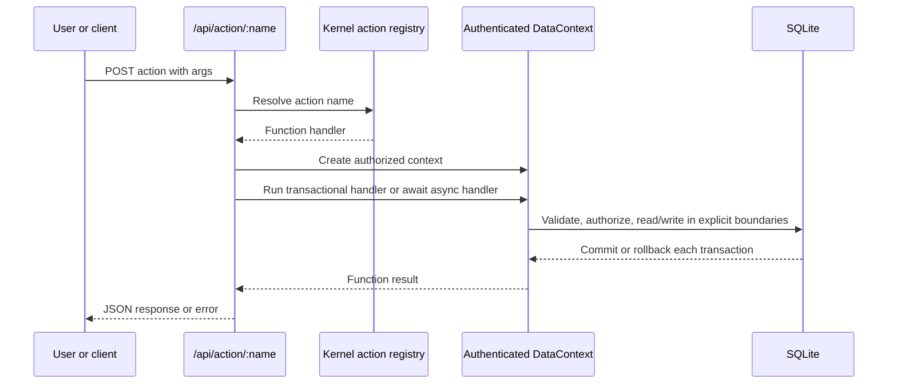

# Develop Functions and actions

## Purpose

Implement an explicit server-side operation that can be invoked by a form action or the named action API.

## When to use a Function

Use a Function for a named operation such as posting an order, recalculating totals, approving a record, or allocating stock. Use hooks/events for lifecycle behavior and [Scripts](scripts.md) for registration of several related handlers.

## Request flow



## Prerequisites

- A table, form, or other metadata target for the operation.
- A privilege that includes the Function.
- A test user with both allowed and denied permissions.

## Function metadata

```json
{
  "kind": "function",
  "name": "SALES_PostOrder",
  "app": "sales",
  "label": "Post order",
  "executionMode": "transactional",
  "code": "const orderId = Number(args.orderId); const order = ctx.find('SALES_Order', orderId); if (!order) throw new Error('Order not found'); if (order.f.status !== 1) throw new Error('Only open orders can be posted'); order.set('status', 2).update(); return { ok: true, orderId };"
}
```

`FunctionMeta.executionMode` is optional and accepts `"transactional"` or `"async"`. The default is `"transactional"`.

The body is invoked with `(ctx, args, kernel, services)`:

- `ctx` is the authenticated `DataContext` for the request.
- `args` contains the JSON action arguments.
- `kernel` is the active runtime and registry.
- `services` provides bounded HTTP and email integrations.

The return value becomes the API response. An `undefined` result is returned as `{ ok: true }`.

## Call a Function from a form

```json
{
  "label": "Post order",
  "type": "function",
  "target": "SALES_PostOrder"
}
```

The endpoint is:

```text
POST /api/action/:name
```

Unknown action names return HTTP 404. The server resolves the action, checks the Function privilege, and creates an authenticated context.

## Choose an execution mode

| Mode | Use it for | Transaction behavior |
| --- | --- | --- |
| `transactional` | Synchronous validation and related database writes | The action route wraps the entire handler in one transaction. Throwing rolls it back. |
| `async` | HTTP, SMTP, or other work that requires `await` | No automatic transaction spans the handler. Use short `ctx.tts()` blocks for related database work. |

Never return a Promise from a transactional Function. Never wait for HTTP or email inside `ctx.tts()`; holding a SQLite transaction open during network I/O increases lock time and can cause contention.

## Transactions and data access

Use the supplied context for all reads and writes. In transactional mode, the action route wraps the handler in a transaction. Nested `ctx.tts()` calls use savepoints. Any thrown error rolls back the current transaction or savepoint.

In async mode, group each atomic set of database changes in a synchronous `ctx.tts()` callback. Complete network work before or after that callback:

```js
const response = await services.http.request({
  url: String(args.url),
  timeoutMs: 10000
});
if (!response.ok) {
  throw new Error(`Remote service returned HTTP ${response.status}`);
}

return ctx.tts(() => {
  const log = ctx.newRecord('SALES_IntegrationLog');
  log.setMany({
    status: response.status,
    responseText: response.text
  }).insert();
  return { ok: true, logId: log.id };
});
```

```js
return ctx.tts(() => {
  const header = ctx.newRecord('SALES_Order');
  header.setMany({
    orderNumber: String(args.orderNumber),
    status: 1,
    customerId: Number(args.customerId)
  }).insert();

  for (const line of args.lines ?? []) {
    ctx.newRecord('SALES_OrderLine').setMany({
      orderId: header.id,
      productId: Number(line.productId),
      quantity: Number(line.quantity),
      unitPrice: Number(line.unitPrice)
    }).insert();
  }

  return { ok: true, orderId: header.id };
});
```

## HTTP service

`services.http.request(input)` accepts:

| Field | Type | Notes |
| --- | --- | --- |
| `url` | `string` | Required; only `http:` and `https:` are accepted. |
| `method` | `string` | Optional; defaults to `GET` without a body or `POST` with a body. |
| `headers` | `Record<string, string>` | Optional request headers. |
| `json` | `unknown` | Optional JSON body; cannot be combined with `text`. |
| `text` | `string` | Optional text body; cannot be combined with `json`. |
| `timeoutMs` | `number` | Defaults to 15,000 ms and is capped at 60,000 ms. |

The Promise resolves to `{ status, ok, headers, text, json }`. `json` contains the parsed response when possible and is otherwise `null`. A non-success HTTP status does not reject the Promise; check `ok` or `status`. Connection errors, timeouts, invalid protocols, and responses larger than 5 MB reject it.

```json
{
  "kind": "function",
  "name": "SALES_SendOrder",
  "app": "sales",
  "label": "Send order",
  "executionMode": "async",
  "code": "const response = await services.http.request({ url: String(args.endpoint), method: 'POST', headers: { authorization: String(args.authorization) }, json: { orderId: Number(args.orderId) }, timeoutMs: 15000 }); if (!response.ok) throw new Error(`Remote service returned HTTP ${response.status}: ${response.text}`); return { ok: true, remote: response.json };"
}
```

Do not put credentials directly in Function metadata. Supply secrets through a controlled server-side mechanism and avoid returning remote headers or bodies that contain sensitive data.

## Email service

Configure SMTP under **Settings → SMTP Settings** before calling `services.email.send(input)`. The input supports `to`, `cc`, and `bcc` as a string or string array; `replyTo`; a required `subject`; and at least one of `text` or `html`.

At least one `to` recipient is required. A message is limited to 50 total recipients and 1 MB across the subject and text/HTML content. The SMTP connection requires TLS 1.2 or later and rejects invalid certificates.

The Promise resolves to `{ messageId, accepted, rejected }`. Inspect `rejected` when the caller needs to confirm delivery acceptance.

```json
{
  "kind": "function",
  "name": "SALES_EmailReceipt",
  "app": "sales",
  "label": "Email receipt",
  "executionMode": "async",
  "code": "const result = await services.email.send({ to: String(args.to), subject: `Receipt ${args.receiptNo}`, text: `Your receipt total is ${args.total}.`, html: `<p>Your receipt total is <strong>${args.total}</strong>.</p>` }); if (result.rejected.length) throw new Error(`SMTP rejected: ${result.rejected.join(', ')}`); return { ok: true, messageId: result.messageId, accepted: result.accepted };"
}
```

SMTP failures, missing configuration, invalid input, encryption-key problems, timeouts, and certificate errors reject the Promise. Catch an error only when the Function can add safe context or perform a deliberate recovery; otherwise let the route return the failure.

## Authorization and errors

The Function must be listed in a privilege assigned through a duty or role. Use the authenticated `ctx`; never create an unrestricted context to bypass permissions. Validate access to the target record and return user-correctable problems as `ValidationError`. Do not expose secrets, SQL details, or internal stack traces.

## Security considerations

Functions are dynamic server-side code. Treat them as trusted administrative code, review changes, restrict Designer access, use unique names, and use only the bounded `services` interfaces for supported HTTP and email integrations. Keep complex reusable or native integrations in reviewed TypeScript.

## Testing and troubleshooting

Test successful input, invalid input, missing records, unauthorized users, rollback after a failed related write, and duplicate action names. For async Functions, also test connection failure, timeout, non-success HTTP status, oversized response, missing SMTP configuration, rejected recipients, and database state when a service fails before or after an explicit transaction. When a Function fails, verify the exact action name, request `args`, execution mode, service configuration, table permissions, record lookup, field types, transaction boundaries, and whether a Script registered the same action.

## Related topics

[Scripts](scripts.md) · [Hooks and data events](hooks-events.md) · [Security](security.md) · [Testing](testing.md)
