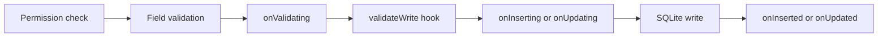

# Use hooks and data events

## Purpose

Place record defaults, validation, and lifecycle reactions at the server-side data boundary so every API, Script, Function, test, and internal service follows the same rules.

## Choose a mechanism

| Requirement | Recommended mechanism |
| --- | --- |
| Field default | Field `default` or `initValue` hook |
| Write validation | `validateWrite` hook or `onValidating` event |
| Delete validation | `validateDelete` hook or `onDeleting` event |
| Lifecycle reaction | Data event |
| Explicit user operation | Function |
| Multiple registrations | Script |
| External/native integration | Reviewed TypeScript |

## Write lifecycle



Pre-events can cancel. Post-events cannot cancel an operation that has already completed.

## Hooks

```ts
interface TableHooks {
  initValue?(record: Record, ctx: DataContext): void;
  validateWrite?(record: Record, ctx: DataContext): boolean | void;
  validateDelete?(record: Record, ctx: DataContext): boolean | void;
}
```

Returning `false` blocks a validation operation. Throwing `ValidationError` provides a useful message.

## Events

| Event | Stage | Can cancel? |
| --- | --- | --- |
| `onValidating` | Common write validation | Yes |
| `onInserting` | Before insert | Yes |
| `onInserted` | After insert | No |
| `onUpdating` | Before update | Yes |
| `onUpdated` | After update | No |
| `onDeleting` | Before delete | Yes |
| `onDeleted` | After delete | No |

Event handlers receive the table, event type, record, authenticated context, and `cancel(reason)` function. Reference delete behavior can be `restrict`, `setNull`, or `cascade`; child writes still follow their normal lifecycle.

## Testing

Test valid writes, rejected writes, rollback, authorization, update validation, delete behavior, and the fact that post-events cannot cancel. Keep business rules deterministic and avoid network calls inside transactions.

## Related topics

[Scripts](scripts.md) · [Functions and actions](functions.md) · [Business logic](business-logic.md) · [Security](security.md)
