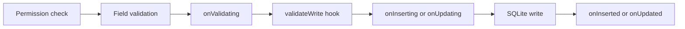

# Use hooks and data events

## Purpose

Place record defaults, validation, and lifecycle reactions at the server-side data boundary so every API, Script, Function, test, and internal service follows the same rules.

## Choose a mechanism

| Requirement | Recommended mechanism |
| --- | --- |
| Field default | Field `default` or `initValue` hook |
| Write validation | `validateWrite` hook or `onValidating` event |
| Delete validation | `validateDelete` hook or `onDeleting` event |
| Lifecycle reaction | Data event |
| Explicit user operation | Function |
| Multiple registrations | Script |
| External/native integration | Reviewed TypeScript |

## Write lifecycle


```mermaid
flowchart LR
    A[Permission check] --> B[Field validation]
    B --> C[onValidating]
    C --> D[validateWrite hook]
    D --> E[onInserting or onUpdating]
    E --> F[SQLite write]
    F --> G[onInserted or onUpdated]
```

Pre-events can cancel. Post-events cannot cancel an operation that has already completed.

## Hooks

```ts
interface TableHooks {
  initValue?(record: Record, ctx: DataContext): void;
  validateWrite?(record: Record, ctx: DataContext): boolean | void;
  validateDelete?(record: Record, ctx: DataContext): boolean | void;
}
```

Returning `false` blocks a validation operation. Throwing `ValidationError` provides a useful message.

### Handlers must be synchronous

Hooks and event handlers run inside the database transaction, so since v1.4.0 they must be synchronous. Registering an `async` function, or returning a Promise from a handler, raises `<table>.<hook>: async lifecycle handlers are not supported` and the write rolls back. This is a breaking change: earlier releases let such code run outside the transaction. Move awaited work, such as HTTP, email, or file access, into an `async` [Function](functions.md) (`executionMode: "async"`) and call that Function explicitly. `ctx.tts()` has the same rule for its callback.

### initValue and drafts

`initValue` runs when a new record is created, which for a generated Form means when the user opens **New**. The values it sets, including read-only fields such as a document number, are shown to the user without inserting a row, and `initValue` does not run again when the draft is saved. Because the record is not stored yet, treat values from `initValue` as proposals: protect them with a unique index, and use `validateWrite` or `onInserting` for anything that must be reserved at write time. See [Understand the record lifecycle](record-lifecycle.md).

## Events

| Event | Stage | Can cancel? |
| --- | --- | --- |
| `onValidating` | Common write validation | Yes |
| `onInserting` | Before insert | Yes |
| `onInserted` | After insert | No |
| `onUpdating` | Before update | Yes |
| `onUpdated` | After update | No |
| `onDeleting` | Before delete | Yes |
| `onDeleted` | After delete | No |

Event handlers are synchronous and receive the table, event type, record, authenticated context, and `cancel(reason)` function. Reference delete behavior can be `restrict`, `setNull`, or `cascade`; child writes still follow their normal lifecycle.

## Testing

Test valid writes, rejected writes, rollback, authorization, update validation, delete behavior, and the fact that post-events cannot cancel. Confirm that no handler is `async` or returns a Promise, and test a draft that is opened, edited, and saved. Keep business rules deterministic and avoid network calls inside transactions.

## Related topics

[Record lifecycle](record-lifecycle.md) · [Scripts](scripts.md) · [Functions and actions](functions.md) · [Business logic](business-logic.md) · [Security](security.md)
