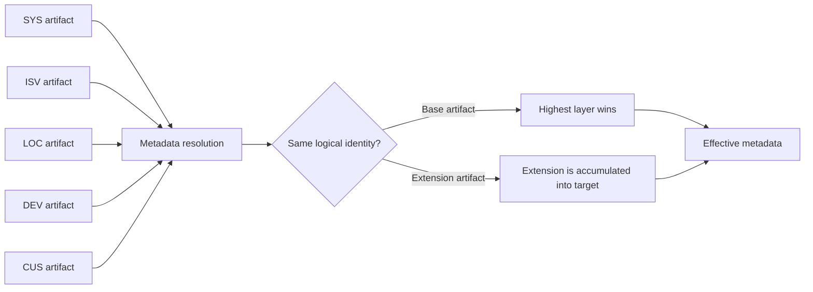

# Work with metadata layers

## Purpose

Use layers to control ownership, precedence, and customization of App/Model metadata without copying the original application definition.

## Audience

Application developers, ISV developers, customizers, and framework administrators.

## Prerequisites

Understand [Apps, Models, and Layers](app-model-layer.md), [metadata](metadata.md), and [Extensions](extensions.md), and know which application or Model owns the artifact being changed.

## Layer order

EmuFramework evaluates layers from lowest to highest precedence:

```text
SYS < ISV < LOC < DEV < CUS
```

| Layer | Typical owner | Typical use |
| --- | --- | --- |
| `SYS` | Framework | Core system definitions |
| `ISV` | Vendor or product team | Product application definitions |
| `LOC` | Localization or site team | Local or regional customization |
| `DEV` | Development team | Development-time customization |
| `CUS` | Customer or implementation team | Customer-specific customization |

## Resolution model



## Base artifacts and Extensions

A base artifact with the same logical identity is overridden by a higher-layer base artifact. An Extension does not replace the target artifact; it contributes fields, indexes, menu items, permissions, or behavior to it.

Use an Extension when the change should be additive and independently removable. Use a higher-layer base artifact only when the complete definition is intentionally owned by that layer.

## Choosing a layer

1. Keep framework-owned definitions in `SYS`.
2. Put reusable product definitions in `ISV`.
3. Put localization or site-specific changes in `LOC`.
4. Put active development changes in `DEV`.
5. Put customer-specific changes in `CUS`.
6. Prefer an Extension over replacing a base artifact when the change is additive.
7. Declare dependencies instead of relying on incidental load order.

## Example

```json
{
  "kind": "tableExtension",
  "name": "SALES_CustomerLocalization",
  "app": "sales",
  "table": "SALES_Customer",
  "layer": "LOC",
  "fields": [
    { "name": "localName", "type": "string", "label": "Local name" }
  ]
}
```

This adds a localized field to `SALES_Customer` without copying or replacing the base table definition.

## Rules and limitations

- Names are stable identifiers; changing them can break references.
- Higher-layer base artifacts can hide lower-layer definitions with the same logical identity.
- Extensions accumulate; they do not provide a general-purpose replacement mechanism.
- An Extension's layer must be strictly higher than its target's layer; the registry rejects an Extension defined at the same layer as its target.
- Only one Extension of a given kind may target the same base artifact from the same app and Model.
- Do not depend on undocumented registration order between artifacts. Apps are now registered following their declared `dependsOn` graph (a dependency loads before any app that depends on it), with layer and name used only to order otherwise-unrelated apps.
- Review schema effects before applying a layer change. Additive synchronization supports new tables, fields, and indexes; destructive changes require migration and backup planning.

## Testing

Test the effective metadata at each relevant layer, verify cross-references and permissions, and test with the Extension or customization enabled and disabled. Confirm that removing a customization does not leave orphaned references.

## Related topics

[Apps, Models, and Layers](app-model-layer.md) · [Metadata](metadata.md) · [Extensions](extensions.md) · [Application workflow](application-workflow.md) · [Security](security.md)
