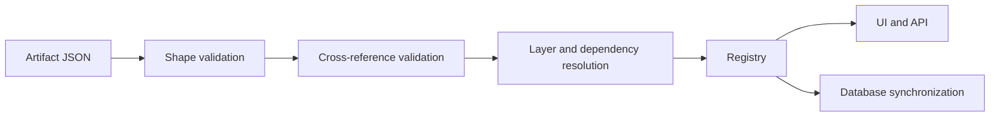

# Work with metadata

## Purpose

Define applications, data structures, UI, security, reports, and server behavior as validated metadata artifacts.

## Audience

Application developers and Web Designer customizers.

## Prerequisites

A configured development environment or Designer permission for the target app.

## Artifact lifecycle



## Concepts

Metadata describes Apps, Models, tables, fields, enums, Forms, menus, Privileges, Duties, Roles, Reports, Views, Charts, Scripts, and Functions. `name` is a stable identifier; `label` is user-facing text. Supported base kinds include `app`, `enum`, `table`, `form`, `menu`, `privilege`, `duty`, `role`, `script`, `function`, `report`, `view`, and `chart`.

Metadata is resolved through ordered layers: `SYS < ISV < LOC < DEV < CUS`. Base artifacts at a higher layer override lower-layer artifacts with the same logical identity; Extensions accumulate into their target. See [Work with metadata layers](layers.md) for ownership and precedence rules.

Applications contain named Models, and Models provide the organizational and ownership context for their metadata. Review [Understand Apps, Models, and Layers](app-model-layer.md) before deciding where an artifact belongs.

Prefer the CLI or Web Designer over repetitive handwritten files. Validate relationships, enum values, menu targets, action targets, and security artifacts together.

## Schema and database rules

Schema synchronization is additive: adding tables, fields, and indexes is supported. Removing or changing existing structures needs an explicit migration and backup plan. Do not declare framework audit fields (`id`, `createdAt`, `createdBy`, `modifiedAt`, `modifiedBy`) as application fields.

## Procedure

1. Choose a stable name, owning App, existing Model, and matching Layer.
2. Define referenced enums and tables before Forms, Views, Charts, Reports, menus, and actions.
3. Validate the artifact shape and cross-references.
4. Review layer, dependencies, and schema effects.
5. Run the application and exercise generated list and form pages.

## Metadata API

The API requires an authenticated session with Designer/customize permission for the target app. It is the channel used by integrations, automation, and deployment pipelines.

### Create an object

```http
POST /api/designer/artifacts
Content-Type: application/json
```

The body is a complete artifact and must include `kind`, `name`, `app`, `model`, and the selected Model's `layer` for business objects. This endpoint is create-only and returns `409` when the name already exists.

```json
{
  "kind": "enum",
  "name": "SALES_OrderStatus",
  "app": "sales",
  "model": "Customizations",
  "layer": "CUS",
  "values": [
    { "name": "Open", "value": 0 },
    { "name": "Confirmed", "value": 1 }
  ]
}
```

A successful response returns status `201`.

### Create or update idempotently

```http
PUT /api/designer/artifacts/{kind}/{name}
```

Use this when an integration needs to upsert the same object repeatedly. The `kind` and `name` in the URL are authoritative.

### Create multiple objects atomically

Use the change-set workflow:

1. `GET /api/designer/snapshot` to obtain the current `revision`.
2. `POST /api/designer/change-sets/validate` with the intended operations.
3. Review the diff, warnings, and any high-risk flags.
4. `POST /api/designer/change-sets/apply` with the returned `previewId` and human confirmation.

A change set is the right tool when creating a Table + Form + Menu + Security graph inside an existing App/Model, since it never leaves the system in a half-applied state. Create the App, then add its Model, before validating that graph.

### Supported object kinds

`app`, `table`, `enum`, `form`, `menu`, `script`, `function`, `report`, `view`, `chart`, `privilege`, `duty`, `role`, `tableExtension`, `enumExtension`, `formExtension`, `menuExtension`, `privilegeExtension`, `dutyExtension`, `roleExtension`, `scriptExtension`

An App is created with `models: []`. Add a Model through Designer or CLI before creating other artifacts. System metadata appears only to a System Administrator in the **Framework — Read-only** scope and is rejected by every mutation and packaging endpoint.

Every API channel validates schema, naming, app/model/layer, dependencies, cross-references, and permissions before saving.

## Related topics

[CLI](cli.md) · [Security](security.md) · [Views and Charts](views-and-charts.md) · [Web Designer](../user/web-designer.md) · [Customization checklist](customization-checklist.md)
