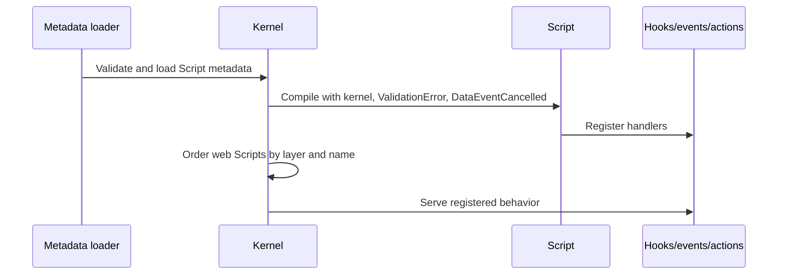

# Develop Scripts

## Purpose

Use a Script artifact to register several related hooks, events, or actions as a small unit of dynamic server-side behavior.

## When to use a Script

Use a Script when behavior is naturally registration-oriented: table validation, lifecycle handlers, or a small group of related actions. Use a [Function](functions.md) for one explicit user operation. Use reviewed TypeScript for external services, native integrations, complex reusable logic, or code that needs stronger typing and review.

## Script lifecycle



## Metadata

```json
{
  "kind": "script",
  "name": "SALES_OrderRules",
  "app": "sales",
  "label": "Order rules",
  "code": "kernel.hooks.register('SALES_Order', { validateWrite(record) { if (Number(record.get('totalAmount') ?? 0) < 0) throw new ValidationError('Order total cannot be negative'); } });"
}
```

The framework compiles Script code as:

```ts
new Function('kernel', 'ValidationError', 'DataEventCancelled', code)
```

The supported globals are `kernel`, `ValidationError`, and `DataEventCancelled`. Register handlers through the kernel; do not assume arbitrary imports or application globals are available.

## Register hooks, events, and actions

```js
kernel.hooks.register('SALES_Order', {
  initValue(record) {
    if (record.get('status') === null) record.set('status', 1);
  },
  validateWrite(record) {
    if (Number(record.get('totalAmount') ?? 0) < 0) {
      throw new ValidationError('Order total cannot be negative');
    }
  }
});

kernel.events.on('SALES_Order', 'onInserted', (event) => {
  event.ctx.newRecord('SALES_OrderAudit').setMany({
    orderId: event.record.id,
    message: 'Order created'
  }).insert();
});
```

Scripts can register an action with `kernel.actions.set(name, handler)`, but prefer a Function artifact when the action is a public, explicit application operation.

## Rules and limitations

- Keep Scripts short, deterministic, and testable.
- Use the authenticated `ctx` supplied to action handlers.
- Do not use network calls inside database transactions.
- Do not rely on accidental registration order; use unique names.
- Function artifacts are registered after web Scripts. A Function with the same action name can replace a Script-registered action according to kernel behavior.
- Scripts and Functions are trusted administrative code compiled with `new Function`.

## Security considerations

Restrict Designer access, review every Script change, keep credentials and production data out of Script code, and take a backup before high-risk changes. The client hiding a button does not authorize a Script action; server-side policy must still reject unauthorized access.

## Testing

Test valid and invalid writes, handler order where relevant, rollback after a thrown error, unauthorized access, and the behavior with the Script enabled and disabled. Run the complete verification suite described in [Run tests and debug](testing.md).

## Related topics

[Functions and actions](functions.md) · [Hooks and data events](hooks-events.md) · [Security](security.md) · [Extensions](extensions.md)
